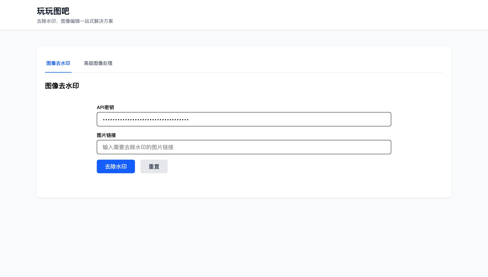

# 图像编辑项目

本项目基于 React 和阿里云通义万相 API，提供在线图片去水印和图像超分辨率（放大）等功能，适合需要快速处理图片的用户。

## 主要功能

- **去水印**：输入图片链接，自动去除图片中的文字水印。
- **图像放大（超分辨率）**：将图片无损放大，提升图片清晰度。

## 使用方法

1. **获取 API 密钥**
   - 访问阿里云通义万相平台，注册并获取 API Key。

2. **操作步骤**
   - 打开网站首页。
   - 在“API密钥”输入框中填写您的 API Key（仅本地存储，安全可靠）。
   - 选择所需的“处理功能”（去水印或图像放大）。
   - 填写“提示词”（可选，默认已填好）。
   - 输入需要处理的“图片链接”。
   - 点击“处理”按钮，等待处理完成后即可查看和下载结果图片。

3. **界面说明**
   - 支持实时显示处理进度。
   - 处理完成后可直接下载处理后的图片。
   - 支持重置表单，方便多次操作。

## API 密钥说明

- API 密钥仅用于调用阿里云通义万相图像编辑服务。
- 密钥信息仅保存在本地浏览器，不会上传到服务器。

## 依赖与启动

1. 安装依赖：
   ```bash
   npm install
   ```
2. 启动开发服务器：
   ```bash
   npm run dev
   ```

## 目录结构

- `src/components/ImageEditor.jsx`：去水印功能组件
- `src/components/ImageProcessing.jsx`：多功能图像处理组件（去水印、超分辨率）
- `src/services/api.js`：API 请求封装

## 示例界面



## 常见问题

- **API 密钥无效？**
  - 请确认密钥填写正确且有调用权限。
- **图片处理失败？**
  - 检查图片链接是否可访问，或稍后重试。
